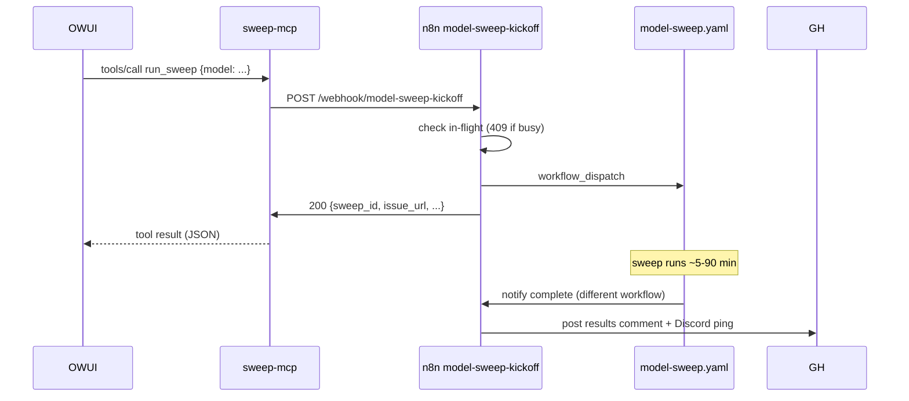

# sweep-mcp

MCP server that exposes the homelab model-testing sweep automation as a single
tool: `run_sweep`. Composes Phase 3 of [model-testing#36][epic] — the operator
says "Run qwen3.7:35b through the sweep test" in OWUI chat, the LLM dispatches
`run_sweep`, this server forwards to the n8n model-sweep-kickoff webhook, and
the existing Phase 1 + 2 chain takes over (GHA sweep → dual-summarize →
tracking issue + Discord ping).

This repo holds the [MIT-licensed](LICENSE) source + Dockerfile. Deploy
manifests live in [dvystrcil/sweep-mcp][deploy].

[epic]: https://github.com/dvystrcil/model-testing/issues/36
[deploy]: https://github.com/dvystrcil/sweep-mcp

## What it does

Just one tool for v1:

| Tool | Inputs | Returns |
|---|---|---|
| `run_sweep` | `model` (required), optional `payload`, `runs`, `requester` | `{sweep_id, run_url, issue_url, issue_number, model, requester, eta}` from the n8n kickoff |

The MCP layer is intentionally thin — it just JSON-marshals the kickoff and
surfaces the n8n response. The single-sweep mutex, GHA dispatch, and tracking
issue creation all live in the n8n workflow that this server forwards to.

Follow-ups that are NOT in v1 but make sense to add later:

- `sweep_status(sweep_id)` — polls the GHA run, returns running/completed
  + percent-complete
- `list_recent_sweeps(limit)` — returns last N sweep_ids with model + status
  for the LLM to pick from when the operator says "rerun the last sweep"

Both require GitHub API auth (the kickoff doesn't); leaving them out keeps
v1's blast radius tight.

## Run locally

```bash
# Build + run against a real n8n
go run ./cmd/sweep-mcp --http=:8080 \
  --n8n-kickoff-url=http://localhost:5678/webhook/model-sweep-kickoff

# In another shell, invoke a tool over the streamable HTTP MCP endpoint:
curl -X POST -H 'Content-Type: application/json' \
  -H 'Accept: application/json, text/event-stream' \
  http://localhost:8080/mcp \
  -d '{"jsonrpc":"2.0","id":1,"method":"initialize","params":{"protocolVersion":"2025-06-18","capabilities":{},"clientInfo":{"name":"smoke","version":"0.0.1"}}}'
```

## Architecture



## Memory hooks

- [[feedback_three_repo_split_for_new_services]] — build (this repo) + deploy
  (sweep-mcp) + ArgoCD app (argocd-projects)
- [[feedback_owui_skillids_vs_skills]] — binding the MCP into OWUI requires
  BOTH `tool_server.connections` AND the preset's `meta.toolIds`
- [[feedback_owui_mcp_dispatch_chain]] — `tool_ids` lives on `form_data`,
  not on `meta.tools` in the chat request
- [[feedback_n8n_expression_must_json_stringify]] — sibling memory; not
  relevant to this repo but mentioned for the related n8n workflow that
  receives our POSTs

## Related

- Epic: https://github.com/dvystrcil/model-testing/issues/36 (Phase 3)
- Parent thesis: https://github.com/dvystrcil/homelab/issues/292 (A2 slot
  4 — autonomous domain agents)
- Sibling MCP servers as conventions: `tor-character-mcp-docker`,
  `rpg-dice-mcp-docker`, `wiki-mcp-docker`
- n8n workflows we forward to:
  - https://github.com/dvystrcil/n8n-workflow/blob/main/workflows/model_sweep_kickoff.json
  - https://github.com/dvystrcil/n8n-workflow/blob/main/workflows/model_sweep_complete.json
